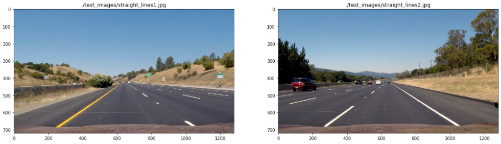
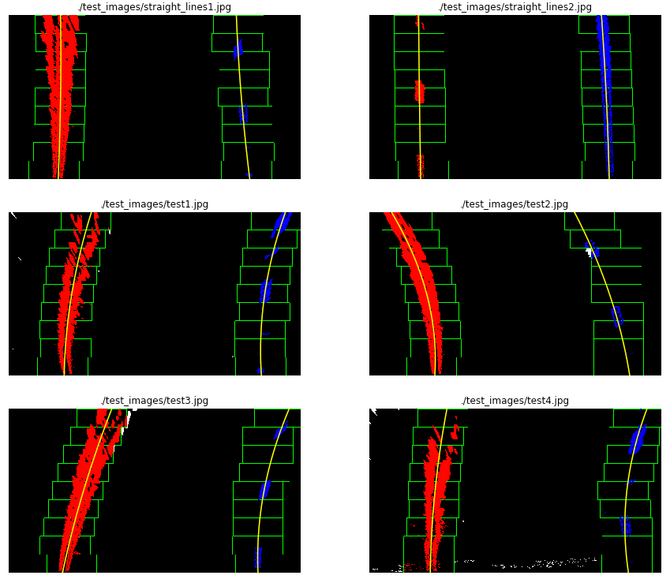

## Advanced Lane Finding
[](http://www.udacity.com/drive)


The Project
---

The goals / steps of this project are the following:

* Compute the camera calibration matrix and distortion coefficients given a set of chessboard images.
* Apply a distortion correction to raw images.
* Use color transforms, gradients, etc., to create a thresholded binary image.
* Apply a perspective transform to rectify binary image ("birds-eye view").
* Detect lane pixels and fit to find the lane boundary.
* Determine the curvature of the lane and vehicle position with respect to center.
* Warp the detected lane boundaries back onto the original image.
* Output visual display of the lane boundaries and numerical estimation of lane curvature and vehicle position.

  The images for camera calibration are stored in the folder called `camera_cal`.  The images in `test_images` are for testing your pipeline on single frames.  If you want to extract more test images from the videos, you can simply use an image writing method like `cv2.imwrite()`, i.e., you can read the video in frame by frame as usual, and for frames you want to save for later you can write to an image file.  

Project Writeup
---

### Camera Calibration

#### 1. Briefly, state how you computed the camera matrix and distortion coefficients. Provide an example of a distortion corrected calibration image.

- [Camera Calibration Notebook](01_camera_calibration.ipynb) 

The corner points of chessboard are stored in array `imgpoints` using `cv2.findChessboardCorners` for each calibrated image. 
The object points are stored on array `objectpoints` and 'z' coordinates of object points will be zeros because chessboard is flate.
Compute objpoints and imgpoints using `cv2.calibrateCamera` function and applied `cv2.undistort` function for distortion correction.


### Pipeline 

#### 1. Describe how (and identify where in your code) you used color transforms, gradients or other methods to create a thresholded binary image. Provide an example of a binary image result.

- [Color Transform and Gradients Threshold Notebook](02_color_transform_and_gradient_threshold.ipynb)

HLS and S channel was applied for color transformation.


Step wise gradient calculation on notebooks as follows,
- Sobel X and Sobel Y
- Magnitude
- Gradient Direction
- Combining SobelX, SobelY, Magnitude, Gradient

Following are different gradients on some test images,


- [Advanced Lane Line Detection Notebook](04_advance_lane_detection.ipynb)

Only combination of Sobel X and Sobel Y is used because combination of all of gradient gives 'noisy' binary image.
Binary image created with combination of gradients on test images,


#### 2. Describe how (and identify where in your code) you performed a perspective transform and provided an example of a transformed image.

- [Presective Transformation Notebook](03_)

Following image was used with straight lines,



Four points were selected on first image as source of perspective transformation.

Given image shows the highlighted points,


The destination points for the transformation where to get a clear picture of the street:

|      Source |        Destination |
| ----------: | -----------------: |
|  (585, 455) |            (200,0) |
|  (705, 455) |    (maxX - 200, 0) |
| (1130, 720) | (maxX - 200, maxY) |
|  (190, 720) |        (200, maxY) |

A transformation matrix was calculated using `cv2.getPerspectiveTransform` and an inverse of transformation matrix taken to map the points back to original space.

The result of the transformation on test image as follows,


The following picture shows the binary images results after the perspective transformation:


#### 4. Describe how (and identify where in your code) you identified lane-line pixels and fit their positions with a polynomial?

- [Advanced Lane Line Detection Notebook](04_advance_lane_detection.ipynb)

 The algorithm calculates the histogram on the X axis. Finds the picks on the right and left side of the image, and collect the non-zero points contained on those windows. When all the points are collected, a polynomial fit is used (using `np.polyfit`) to find the line model.  Another polynomial fit is done on the same points transforming pixels to meters to be used later on the curvature calculation. The following picture shows the points found on each window, the windows and the polynomials:



#### 5. Describe how (and identify where in your code) you calculated the radius of curvature of the lane and the position of the vehicle on the center.

In step 4, a polynomial was calculated on the meters space to be used here to calculate the curvature. The formula is the following:

```
((1 + (2*fit[0]*yRange*ym_per_pix + fit[1])**2)**1.5) / np.absolute(2*fit[0])
```
where `fit` is the the array containing the polynomial, `yRange` is the max Y value and `ym_per_pix` is the meter per pixel value.

To find the vehicle position on the center:

- Calculate the lane center by evaluating the left and right polynomials at the maximum Y and find the middle point.
- Calculate the vehicle center transforming the center of the image from pixels to meters.
- The sign between the distance between the lane center and the vehicle center gives if the vehicle is on to the left or the right.

#### 6. Provide an example image of your result plotted back down onto the road such that the lane area is identified clearly.

To display the lane lines on the image, the polynomials where evaluated on a lineal space of the Y coordinates. The generated points where mapped back to the image space using the inverse transformation matrix generated by the perspective transformation.

following images are examples of this mapping:


### Pipeline (video)

#### 1. Provide a link to your final video output. Your pipeline should perform reasonably well on the entire project video (wobbly lines are ok but no catastrophic failures that would cause the car to drive off the road!).

- [video_output](./video_output/project_video.mp4) 

### Discussion

#### 1. Briefly, discuss any problems/issues you faced in your implementation of this project. Where will your pipeline likely fail? What could you do to make it more robust?

- Few improvements that could be done on the performance of the process due to repetitive calculations.

- To improve the robustness of the process more information could be use from frame to frame.
- To improve the line detection other gradients could be use such as Laplacian.